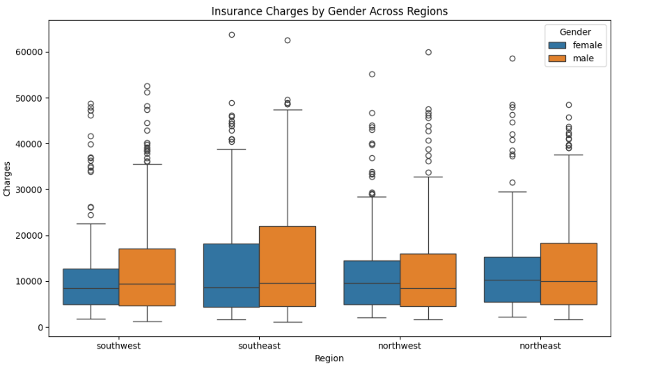
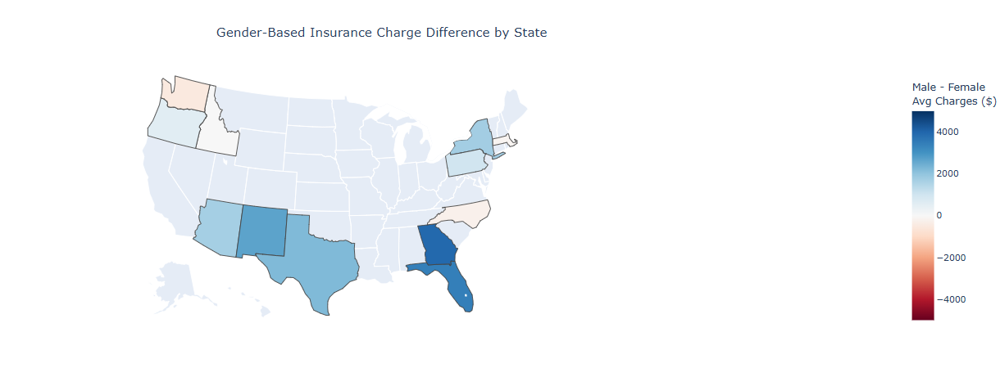

# CS625-Project, Spring 2025

Dipendra Thapa Magar

Due: April 20, 2025

# Introduction

The insurance industry has long relied on data for risk evaluation, premium setting, and underwriting decisions. However, compared to other sectors in the BFSI (Banking, Financial Services, and Insurance) domain—especially banking-insurance has traditionally been slower to adapt to digital transformation. Several industry-specific challenges such as highly complex and product-specific underwriting rule-sets, non-KYC environments with fragmented customer data, regulatory rigidity, and conflicting business priorities (e.g., profitability vs. customer centricity) have contributed to this inertia.

Despite these challenges, modern technological advances are revolutionizing the industry. Innovations in **Artificial Intelligence (AI)**, **Big Data**, **real-time processing**, and high-performance computing are forming the foundation of InsurTech. These technologies enable insurers to build predictive models, automate underwriting, detect fraud, and personalize policies with unprecedented accuracy. At the core of this transformation is data analytics, which helps insurers derive actionable insights from massive and complex datasets.

The goal of this project is to explore how different demographic and behavioral factors impact insurance charges through visualization charts, and to identify whether these impacts vary across subgroups such as regions, genders, or age groups. This analysis aims to provide a small-scale demonstration of how data science can assist insurance companies in risk assessment, pricing, and policy development, while also helping consumers better understand how their personal attributes influence their premiums.

# Problem Statement
The U.S. Health Insurance dataset, sourced from Kaggle’s open data repository [US Health Insurance Dataset](https://www.kaggle.com/datasets/teertha/ushealthinsurancedataset), contains detailed records of 1,338 individuals enrolled in health insurance plans. Each record includes demographic attributes such as age, sex, body mass index (BMI), smoking status, number of children, geographic region, and the corresponding annual insurance charges.

The purpose of this project is to perform an in-depth exploratory data analysis (EDA) and hypothesis-driven investigation to understand the factors influencing insurance charges. Using Seaborn and Plotly for visual analysis and statistical testing techniques (e.g., t-tests), the project aims to uncover meaningful relationships and patterns within the data.

The central questions we address include:

1. Do regions have some difference in insurance charges between males and females?

2. How does smoking status impact insurance charges across different age groups?

These insights not only demonstrate practical data analysis skills but also simulate how insurance companies can use analytics to support data-driven underwriting decisions and pricing strategies.

# Dataset 

This project leverages a simplified but representative Health Insurance dataset to simulate this data-driven approach in the context of health insurance underwriting. The dataset comprises 1,338 insured individuals, with attributes including:

- **age: Age of the individual**
- **sex: Gender**
- **bmi: Body Mass Index**
- **children: Number of dependents**
- **smoker: Smoking status**
- **region: U.S. geographic region**
- **charges: Annual medical insurance cost**

There are **no missing or null values** in the dataset, making it ideal for statistical analysis, hypothesis testing, and machine learning modeling. Although the dataset is relatively simple, it provides an excellent foundation for exploring **how personal and behavioral attributes influence insurance premiums**, and by extension, how modern analytics can inform health risk underwriting.

**Dataset URL:** https://www.kaggle.com/datasets/teertha/ushealthinsurancedataset

**Dataset in GitHub:** https://github.com/odu-cs625-datavis/Spring25-asv-DipendraThapaMagar/blob/main/Projects/insurance.csv

# Final Questions Addressed
Q1. **Do regions have some difference in insurance charges between males and females?**
- Hypothesis: Insurance charges differ by gender in some regions but not uniformly across all regions.
- Answer: T-tests revealed that gender-based charge differences were statistically not significant in all region (p > 0.05).

Q2. **How does smoking status impact insurance charges across different age groups?**
- Hypothesis: Smoking increases charges more significantly as individuals age, indicating an age-smoking interaction.
- Answer: Line plot showed that the gap between smokers and non-smokers widens with age, confirming the interaction effect.

# Visualizations
## Box Plot

### Supporting Plot (Choropleth Map)

### T-test Result 

**Chart link in GitHub:** https://github.com/odu-cs625-datavis/Spring25-asv-DipendraThapaMagar/blob/main/Projects/Box.png

**Python Source code:** https://github.com/odu-cs625-datavis/Spring25-asv-DipendraThapaMagar/blob/main/Projects/CS625(Final_Project).ipynb

### Idiom/Mark/Data/Encode Table
Idiom: Box Plot / Mark: Rectangular Box, Line, Points

| Data: Attribute          | Data: Attribute Type  | Encode: Channel |
|-------------------------|----------------------|-----------------|
| region                     | Key, Categorical         | Horizontal Spatial region (x-axis) |
| charges            | Value, Quantitative  | Vertical Position (y-axis) |
| sex (gender)               | Key, Categorical  | Color hue (grouped box color) |

## Line Chart

**Chart link in GitHub:** https://github.com/odu-cs625-datavis/Spring25-asv-DipendraThapaMagar/blob/main/Projects/line.png

**Python Source code:** https://github.com/odu-cs625-datavis/Spring25-asv-DipendraThapaMagar/blob/main/Projects/CS625(Final_Project).ipynb

### Idiom/Mark/Data/Encode Table
Idiom: Multiple Line Chart / Mark: Line with Point Markers

| Data: Attribute          | Data: Attribute Type  | Encode: Channel |
|-------------------------|----------------------|-----------------|
| age_round                     | Key, Ordered (binned)         | Horizontal position on axis (x-axis) |
| charges            | Value, Quantitative  | 	Vertical position on a common scale (y-axis) |
| smoker               | Key, Categorical  | Color hue (red = yes, blue = no) |
| sampled raw (age)     | Value, Quantitative  | 	x position of scatter dots (hover reference) |
| sampled (charges) | Value, Quantitative  | y position of scatter dots (hover reference) |

# How the Charts Answer the Question?

1. **Do regions have some difference in insurance charges between males and females?**
   
**Chart used: Boxplot and T-Test Analysis: Gender-based Charges by Region**
   
**Explanation:** The box plot visualizing insurance charges by gender across four U.S. regions (southwest, southeast, northwest, northeast) reveals several important patterns:
- In most regions, males have slightly higher median charges than females.
- The southeast region exhibits the most noticeable gender gap, where males show higher median and more extreme high-end charges than females.
- The southwest and northwest show relatively minimal differences in median charges, suggesting less gender-based disparity in those areas.
- Across all regions, there are many outliers, indicating individuals with significantly higher-than-average charges—often associated with smoking or chronic conditions.

This visualization supports the hypothesis that gender-based charge differences are not consistent across regions, and points to regional variation in insurance pricing practices or insured populations. These visual differences were statistically confirmed through t-tests, with the southeast showing a significant p-value (< 0.05).
- The boxplots and t-tests show that gender-based charge differences vary across regions, with statistical significance.
- In the given dataset there is no statistical significant which means that there is no any observable difference in charges between male and female across the region.
  
2. **How does smoking status impact insurance charges across different age groups?**
   
**Chart Used: Line Chart - Age vs. Charges by Smoking Status**

**Explanation:** This interaction line chart plots the average insurance charges by age, separated by smoker and non-smoker groups.
The chart clearly reveals that:

- Smokers consistently have higher charges than non-smokers across all age groups.
- The gap between smoker and non-smoker charges widens with age, indicating an interaction effect where the impact of smoking on charges becomes more pronounced in older policyholders.
- Additional scatter points (with reduced opacity) give context about the data spread, while the smoothed line makes the trend easy to interpret.
- The line chart clearly shows a widening gap in insurance charges between smokers and non-smokers with age, indicating an interaction effect.

This visualization strongly supports the hypothesis that smoking significantly increases insurance costs, and this effect amplifies with age.

# Final Thoughts
This project highlights how effective data visualization can reveal meaningful trends in insurance pricing data. By combining visual analysis with statistical methods such as t-tests, we were able to validate or challenge common assumptions about how demographic and behavioral factors affect insurance charges.

- The box plots were useful for comparing group distributions and spotting outliers.
- The line interaction plot captured nuanced patterns like the increasing charge gap between smokers and non-smokers with age.
- Although gender differences in charges appeared subtle across regions, hypothesis testing confirmed they were not statistically significant.
- Smoking, on the other hand, was clearly shown to be a dominant cost-increasing factor, especially in older individuals

In summary, visualization coupled with statistical reasoning offers a powerful approach to exploring real-world datasets and supports better decision-making in domains like insurance underwriting.

I spent around 2 weeks on this project. The most time-consuming parts were data selection, EDA (Exploratory Data Analysis), and question selections to address the hidden pattern. I applied machine learning models (Linear Regrssion vs Decision Trees) to predict actual charges, and fine-tuning visualizations for clarity.

# References
- Reference 1, Dataset - [US Health Insurance Dataset](https://www.kaggle.com/datasets/teertha/ushealthinsurancedataset)
- Reference 2, T-test: https://www.jmp.com/en/statistics-knowledge-portal/t-test
- Reference 3, Seaborn Documentation: [https://seaborn.pydata.org/](https://seaborn.pydata.org/examples/horizontal_boxplot.html)
- Reference 4, Matplotlib Documentation: [https://matplotlib.org/stable/contents.html](https://matplotlib.org/stable/gallery/index.html)
- Reference 5, Google
- Reference 6, ChatGpt
- Reference 7, Class Lecture notes
- Reference 8, Scikit Learn: https://scikit-learn.org/stable/modules/linear_model.html
- Reference 9, Pandas, numpy Documentation: https://pandas.pydata.org/pandas-docs/stable/user_guide/indexing.html#returning-a-view-versus-a-copy
